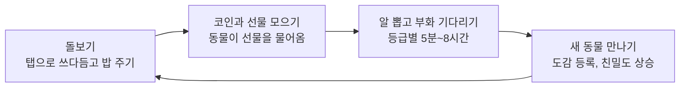

# 핵심 게임 루프

**돌볼수록 선물이 늘고, 선물로 새 동물을 뽑는다.**

```mermaid
flowchart LR
    A["돌보기<br/>탭으로 쓰다듬고 밥 주기"] --> B["코인과 선물 모으기<br/>동물이 선물을 물어옴"]
    B --> C["알 뽑고 부화 기다리기<br/>등급별 5분~8시간"]
    C --> D["새 동물 만나기<br/>도감 등록, 친밀도 상승"]
    D --> A
```

동물이 늘수록 선물도 늘어납니다.

한 바퀴가 3~5분입니다. 알이 부화하는 동안 게임을 닫았다가, 부화 알림을 받고 다시 들어와 새 동물을 만나는 것이 하루의 리듬입니다.
